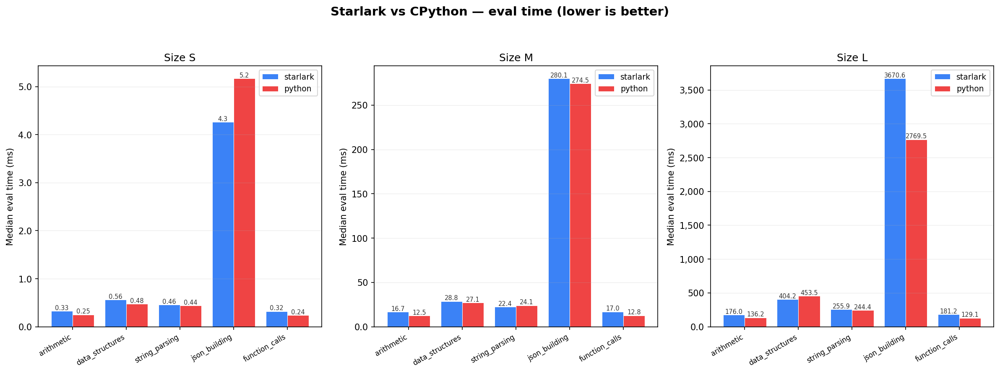

# starlark_bench

A reproducible benchmark suite comparing **Starlark** (Meta's Rust implementation) and **CPython** execution performance across representative workloads.

## What this measures

Five workload families, each parametrized by problem size (S / M / L):

| Workload | What it exercises |
|---|---|
| `arithmetic` | Integer LCG, float accumulation, branching on remainders |
| `data_structures` | Dict insert/lookup, list append, iteration, slicing |
| `string_parsing` | Build CSV records, join into blob, split and parse back |
| `json_building` | Construct nested dicts/lists, manually serialize to JSON strings |
| `function_calls` | Hot loop calling small/medium nested functions (call overhead) |

Every workload is implemented identically in Starlark and Python.
Both produce the same deterministic checksum for a given `(n, seed)` pair (`make verify` checks this).

### Engines

| Engine | How it runs |
|---|---|
| **Starlark** | Embedded via the [`starlark`](https://crates.io/crates/starlark) 0.13 crate. The script is parsed and frozen once; on each iteration the harness calls `run(n, seed)` through `Evaluator::eval_function`. Only function execution time is measured. |
| **CPython** | Spawned as a subprocess. The Python script defines `run(n, seed)`, then calls it `iters` times internally, timing each call with `time.perf_counter_ns()`. Reported `eval_ns` excludes interpreter startup. |

### Size mapping

| Size | N |
|---|---|
| S | 1,000 |
| M | 50,000 |
| L | 500,000 |

Override with `--n <value>` for custom sizes.

## Prerequisites

- **Rust** stable toolchain (tested on 1.70+)
- **Python** 3.11+ (on PATH as `python3`, or pass `--python <path>`)
- **matplotlib** (optional, for chart generation): `pip install matplotlib`

## Quick start

```bash
# Build
cargo build --release

# Smoke test — runs every engine/workload at size S (fast)
make smoke

# Verify checksums match between engines
make verify

# Full benchmark run (all sizes) → results.jsonl + chart
make chart

# Or step by step:
make run-all              # writes results.jsonl
make plot                 # reads results.jsonl, writes bench_chart.png
```

## CLI reference

```
cargo run --release --bin bench -- [OPTIONS]

Required:
  --engine <starlark|python>
  --workload <arithmetic|data_structures|string_parsing|json_building|function_calls>

Optional:
  --size <S|M|L>             Problem size preset [default: M]
  --n <N>                    Override N directly
  --iters <N>                Measurement iterations [default: 10]
  --warmup <N>               Warmup iterations [default: 3]
  --seed <N>                 RNG seed [default: 42]
  --python <PATH>            Python binary [default: python3]
  --scripts-dir <PATH>       Scripts root [default: ./scripts]
  --reuse-module             (Starlark only) Reuse the same Module across iterations
                             instead of creating a fresh one each time. Reports
                             engine as "starlark-reuse". [default: false]
```

### Examples

```bash
# Single workload, custom size
bench --engine starlark --workload arithmetic --n 200000 --iters 20

# Pipe results to a file
bench --engine python --workload json_building --size L >> results.jsonl
```

## Output format

One JSON object per line (JSON Lines):

```json
{
  "engine": "starlark",
  "workload": "arithmetic",
  "size": "M",
  "n": 50000,
  "seed": 42,
  "iter": 0,
  "warmup": false,
  "parse_ns": 118990,
  "eval_ns": 17874842,
  "total_ns": 17874842,
  "result": 364160782,
  "rss_kb": 32236,
  "cpu_model": "AMD Ryzen 7 9700X 8-Core Processor",
  "os": "linux-x86_64",
  "rustc": "rustc 1.93.0 (...)"
}
```

Key fields:

| Field | Description |
|---|---|
| `eval_ns` | **Primary metric.** Workload execution time in nanoseconds. For Starlark this is `eval_function` wall time; for Python it is `time.perf_counter_ns()` measured inside the script. |
| `parse_ns` | Starlark only, first iteration only. Time to parse the AST (not included in `eval_ns`). |
| `wall_ns` | Per-iteration wall-clock time measured from Rust (ns). Comparable across engines. Includes per-iteration overhead (Module setup for Starlark, subprocess-amortized wall time for Python). |
| `total_ns` | **Legacy.** For Starlark: equals `eval_ns`. For Python: subprocess wall time / iter count. Prefer `wall_ns` or `eval_ns` for cross-engine comparisons. |
| `result` | Checksum. Must be identical across engines for the same `(workload, n, seed)`. |
| `warmup` | `true` for warmup iterations. Filter these out for analysis. |
| `rss_kb` | Resident set size in KiB (engine-local, **not** comparable across engines). Starlark: host process VmRSS. Python: `getrusage` max RSS. |
| `rss_note` | Optional. Describes the RSS measurement method for this engine. |

## Chart generation

```bash
# From existing results
python3 scripts/plot.py results.jsonl -o chart.png

# From stdin
make run-all SIZES=M | python3 scripts/plot.py -o chart.png
```

Produces a grouped bar chart: blue = Starlark, red = Python, lower = better.
One subplot per size. Median `eval_ns` across measurement iterations, displayed in milliseconds.

## Makefile targets

| Target | Description |
|---|---|
| `make build` | `cargo build --release` |
| `make smoke` | Size S, 1 warmup + 1 iter for every combination |
| `make run-all` | Full run, all sizes (override: `SIZES="S M"`), writes `results.jsonl` |
| `make plot` | Generate `bench_chart.png` from `results.jsonl` |
| `make chart` | `run-all` + `plot` in one step |
| `make verify` | Assert identical checksums across engines (size S) |
| `make clean` | `cargo clean` |

## Reducing measurement noise

- **Linux**: pin CPU governor to performance mode:
  ```bash
  sudo cpupower frequency-set -g performance
  ```
- **macOS**: close background apps; no userspace governor control.
- **Windows**: set power plan to "High Performance".
- **All platforms**: run from a plain terminal (not IDE), close browsers, use at least 10 iters, report **median** not mean.

## Design decisions and assumptions

1. **Subprocess for Python, embedded for Starlark.** This matches real-world usage: Starlark is typically embedded in a host program; CPython is typically a separate process. The `eval_ns` metric isolates workload execution in both cases.

2. **Parse once for Starlark.** The AST is parsed and the module frozen during setup. Each benchmark iteration calls the frozen `run()` function on a fresh `Module`. This mirrors how an embedding application would use Starlark in production.

3. **Python loops internally.** A single subprocess invocation runs the workload `iters` times. This avoids measuring process startup on every iteration. The per-iteration `eval_ns` is measured with `time.perf_counter_ns()` inside the script.

4. **Deterministic via seeded LCG.** All workloads use a linear congruential generator `x = (x * 1103515245 + 12345) % 2^31` seeded from the `--seed` parameter. No system RNG, no IO.

5. **Dead-code elimination prevention.** Every workload returns a checksum that feeds into `std::hint::black_box` (Starlark) or is serialized to JSON (Python).

6. **No bitwise operators.** The workloads avoid `^`, `&`, `|`, `<<`, `>>` because their availability varies across Starlark dialects.

7. **Arbitrary-precision integers.** Both Starlark and CPython use big integers. The benchmark tests interpreter dispatch overhead, not native arithmetic throughput. All intermediate values are reduced modulo 2^31.

8. **Fresh Module per iteration (default).** Each Starlark iteration creates a new `Module`, imports the frozen symbols, then times only `eval_function`. This measures isolated execution with no cross-iteration heap accumulation. Use `--reuse-module` for "hot interpreter" mode where the same Module (and its heap) persists across iterations.

## Interpretation pitfalls

- **Don't compare `total_ns` across engines.** The `total_ns` field is a legacy metric with different semantics per engine. Use `wall_ns` for cross-engine wall-clock comparisons, or `eval_ns` for pure workload execution comparisons.
- **RSS is engine-local only.** Starlark's `rss_kb` is the full host process VmRSS (includes the Rust runtime and all allocations). Python's `rss_kb` is `getrusage` max RSS of the subprocess. These numbers have different baselines and cannot be subtracted or divided to get a meaningful ratio. Compare each engine's RSS trend across sizes, not across engines.
- **Size L on `json_building` may be killed by OOM.** This workload builds millions of temporary strings and nested structures. Starlark's bump allocator never frees memory within a Module — each iteration allocates a fresh ~50–120 MB heap, and the OS may not reclaim the previous Module's pages fast enough. On memory-constrained environments (WSL2, CI runners, small VMs) the process can be killed by the OOM killer (exit code 137) after 2–3 iterations. Workarounds: use `--iters 1 --warmup 1`, run with `--size M` instead, or increase available RAM/swap. The first cold iteration is also 3–5x slower than steady state due to bump allocator growth.
- **First Python iteration in a batch may be slower** due to function compilation (Python's internal peephole optimizer). Filter `iter == 0` or use warmup.
- **Always use release builds.** The starlark crate is dramatically slower in debug mode. Never benchmark with `cargo run` without `--release`.

## Results

Measured on:

- **CPU**: AMD Ryzen 7 9700X 8-Core Processor
- **OS**: Linux x86_64 (WSL2, kernel 5.15)
- **Rust**: 1.93.0 (stable), release build with `opt-level = 3`, thin LTO
- **Python**: CPython 3.12.3
- **Starlark**: `starlark` crate 0.13.0 (Meta/Facebook)

Median `eval_ns` over 10 measurement iterations (3 warmup discarded). Ratio > 1 means Starlark is slower.



| Workload | Size | Starlark (ms) | Python (ms) | Ratio (S/P) |
|---|---|---:|---:|---:|
| arithmetic | S | 0.3 | 0.3 | 1.30x |
| data_structures | S | 0.6 | 0.5 | 1.17x |
| string_parsing | S | 0.5 | 0.4 | 1.04x |
| json_building | S | 4.3 | 5.2 | **0.82x** |
| function_calls | S | 0.3 | 0.2 | 1.34x |
| arithmetic | M | 16.7 | 12.5 | 1.34x |
| data_structures | M | 28.8 | 27.1 | 1.06x |
| string_parsing | M | 22.4 | 24.1 | **0.93x** |
| json_building | M | 280.1 | 274.5 | 1.02x |
| function_calls | M | 17.0 | 12.8 | 1.33x |
| arithmetic | L | 176.0 | 136.2 | 1.29x |
| data_structures | L | 404.2 | 453.5 | **0.89x** |
| string_parsing | L | 255.9 | 244.4 | 1.05x |
| json_building | L | 3670.6 | 2769.5 | 1.33x |
| function_calls | L | 181.2 | 129.1 | 1.40x |

### Key observations

1. **Starlark and CPython are in the same ballpark.** Across all workloads and sizes, the ratio stays within 0.82x–1.40x. Neither interpreter dominates across the board.

2. **CPython is faster at pure arithmetic and function calls (~1.3x).** CPython's bytecode interpreter and optimized `CALL` opcode give it an edge in tight loops with integer math and frequent function invocations.

3. **Starlark wins on data structures at large scale.** At size L, `data_structures` shows Starlark at 404 ms vs Python's 454 ms (0.89x). The starlark crate's `SmallMap` and bump allocator handle dict-heavy workloads efficiently when the working set grows.

4. **String operations are near parity.** `string_parsing` fluctuates around 1.0x across all sizes. Both interpreters delegate string operations (`split`, `join`, `int()` parsing) to native code.

5. **`json_building` diverges at scale.** At S/M the two are close, but at L Starlark takes 3.7s vs Python's 2.8s (1.33x). This workload creates millions of small temporary strings and nested function calls — it compounds the function-call overhead disadvantage.

6. **Starlark has no GIL and no GC pauses.** While not visible in single-threaded benchmarks, Starlark's bump allocator means zero GC jitter. In latency-sensitive embedding scenarios (build systems, config evaluation), this can matter more than raw throughput.

7. **First-iteration cold start.** Starlark's `json_building` at L shows a dramatic first-iteration penalty (11–21s vs 3.7s steady state). This is the bump allocator growing to accommodate the working set. Subsequent iterations reuse the expanded heap. Warmup is essential.

### Bottom line

For typical Starlark use cases (config files, build rules, policy scripts) where N is small-to-medium and the script runs once, **performance is comparable to CPython**. Starlark's value proposition is not raw speed — it is determinism, hermeticity, and safe embedding.

## CI

The included [GitHub Actions workflow](.github/workflows/bench.yml) runs a smoke test on Linux, macOS, and Windows, including checksum verification.

## License

This benchmark suite is provided as-is for evaluation purposes.
